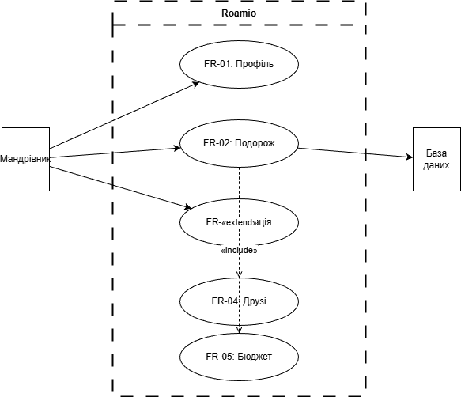
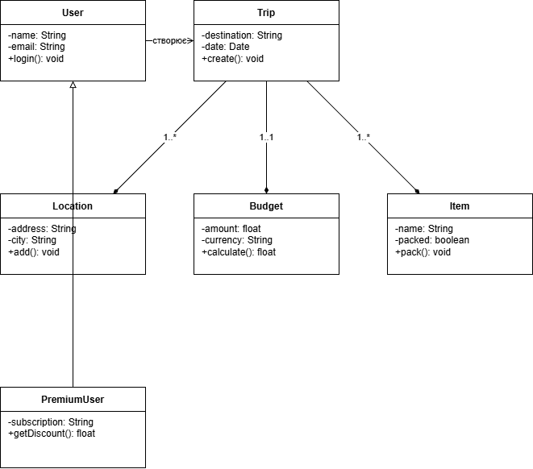
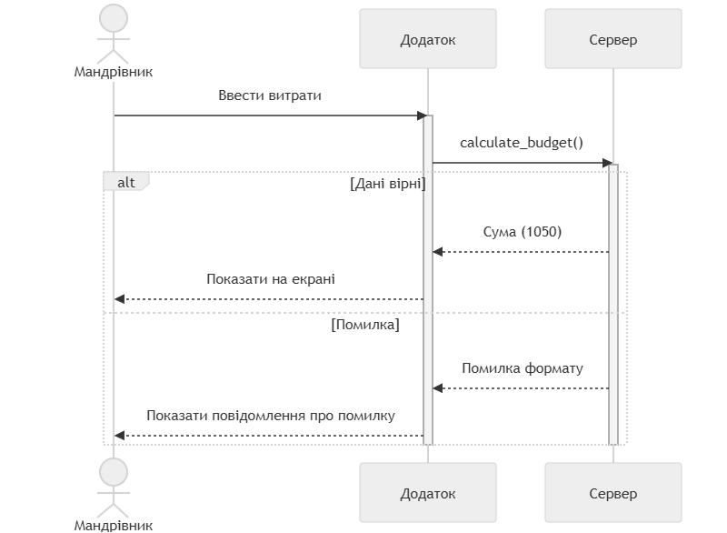

# Лабораторна робота №2
**Проєкт:** Roamio — International Trip Planner

## Крок 1-2. Функціональні вимоги
* FR-01: Управління профілем.
* FR-02: Створення подорожі.
* FR-03: Додавання локації.
* FR-04: Запрошення друзів.
* FR-05: Розрахунок бюджету.

## Крок 3. Діаграма прецедентів (Use Case)

## Крок 4. Діаграма класів (Class Diagram)

## Крок 5. Діаграма послідовності (Sequence Diagram)

## Крок 6. Матриця трасовності
| Вимога | Use Case | Класи | Діаграма послідовності |
| :--- | :--- | :--- | :--- |
| FR-01 | Профіль | User | Ні |
| FR-02 | Подорож | Trip, User | Ні |
| FR-03 | Локація | Trip, Location | Ні |
| FR-04 | Друзі | Trip, User | Ні |
| FR-05 | Бюджет | Trip, Budget | Так |