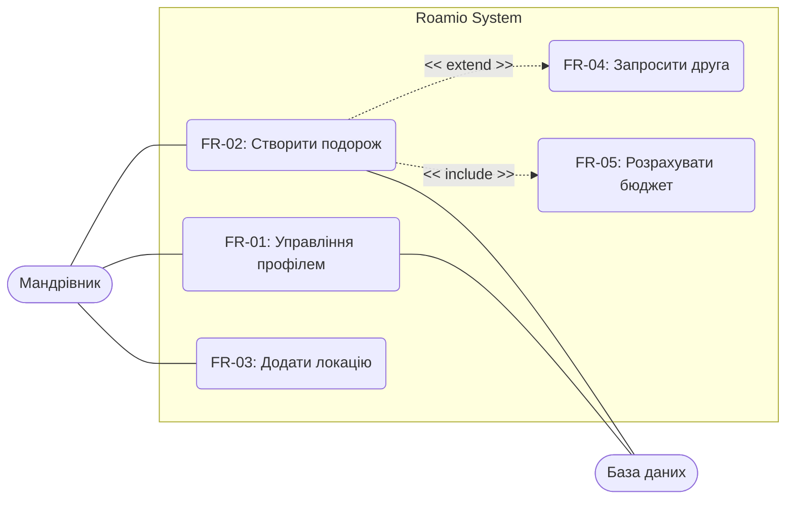
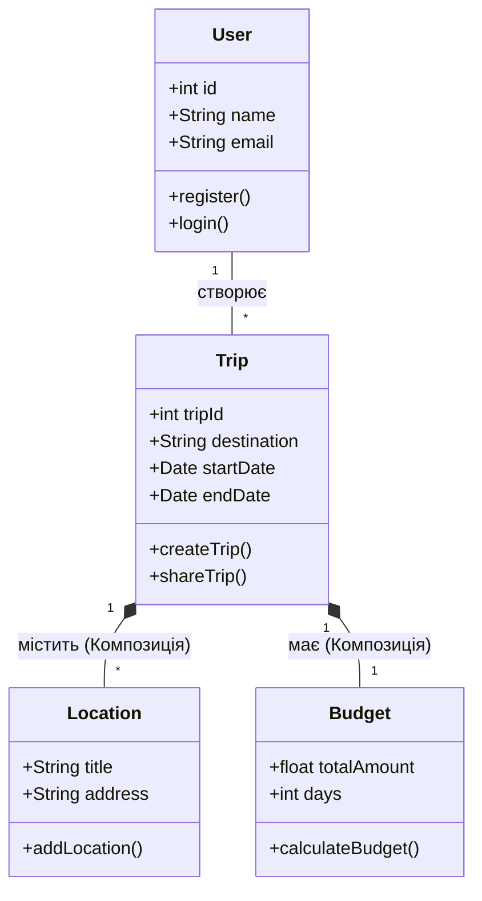
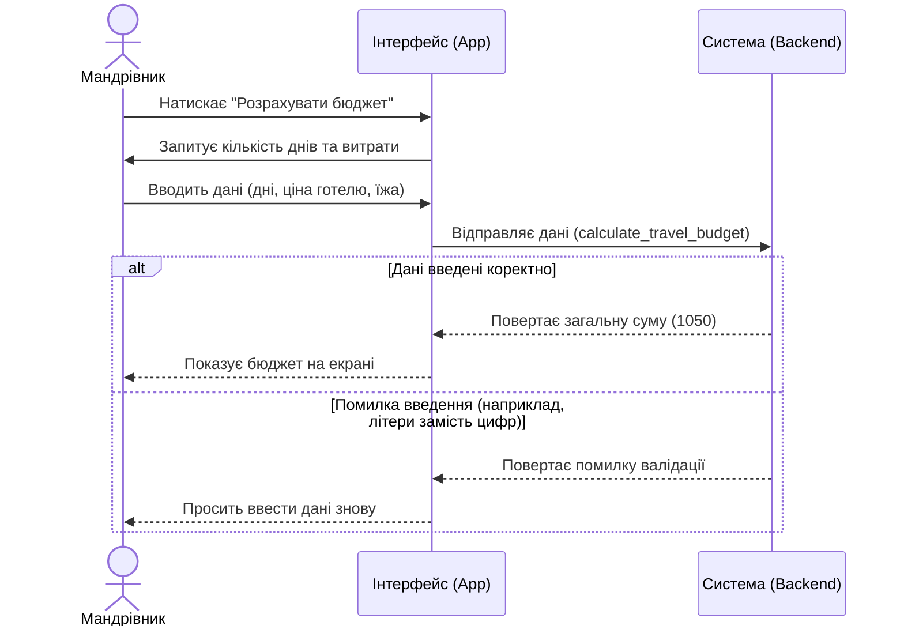

**Проєкт:** Roamio — International Trip Planner

* **FR-01:** Реєстрація та управління профілем.
* **FR-02:** Створення подорожі (дати, країна).
* **FR-03:** Формування маршруту (додавання локацій).
* **FR-04:** Спільне планування з іншими користувачами.
* **FR-05:** Розрахунок бюджету подорожі (калькуляція).
* **FR-06:** Генерація списку речей.

Актори: Мандрівник (Tourist), База даних (Database).

## Крок 4. Діаграма класів (Class Diagram)

## Крок 5. Діаграма послідовності (Sequence Diagram)
Сценарій: Розрахунок бюджету подорожі (FR-05).

## Крок 6. Матриця трасовності

| Функціональна вимога | Прецедент (Use Case) | Задіяні класи | Діаграма послідовності |
| :--- | :--- | :--- | :--- |
| FR-01: Управління профілем | UC1: Управління профілем | User | Ні |
| FR-02: Створення подорожі | UC2: Створити подорож | Trip, User | Ні |
| FR-03: Додавання локації | UC3: Додати локацію | Trip, Location | Ні |
| FR-04: Спільне планування | UC4: Запросити друга | Trip, User | Ні |
| **FR-05: Розрахунок бюджету** | **UC5: Розрахувати бюджет** | **Trip, Budget** | **Так (див. Крок 5)** |